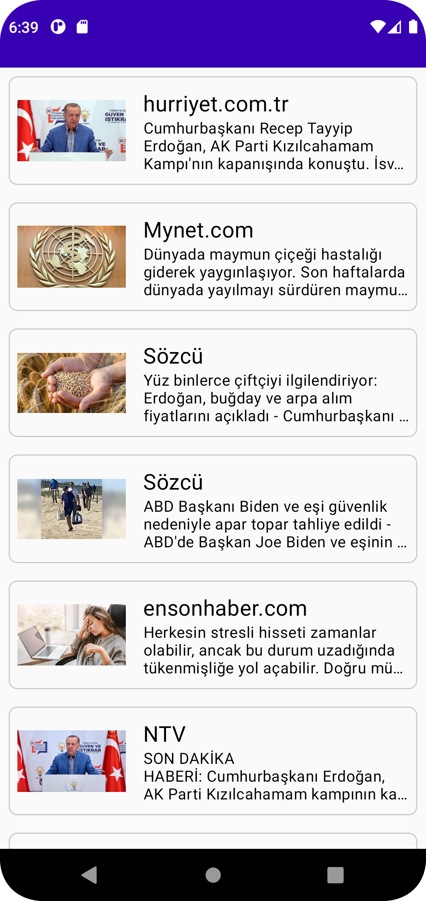

# Newsletter-Kmm

MVP sample created for Kotlin Multiplatform Mobile using NewsApi

## Android GIF

 

## Android ScreenShot

 

## iOS (Coming Soon)
Will be developed with SwiftUi

## Tech Stack
- Kotlin
- Jetpack Compose
- Hilt
- Coil
- Ktor
- Livedata
