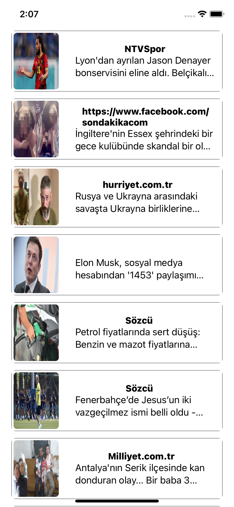

# Newsletter-Kmm

MVP sample created for Kotlin Multiplatform Mobile using NewsApi

<table style="padding:10px">
	<tr>
		<td align="center">
			<h2>Android App</h2>
		</td>
		<td align="center">
			<h2>IOS App</h2>
		</td>
  	</tr>
	<tr>
    	<td align="center">
			
    	</td>
		<td align="center">
			
    	</td>
  	</tr>
</table>

<table style="padding:10px">
	<tr>
		<td align="center">
			<h2>Android GIF</h2>
		</td>
		<td align="center">
			<h2>IOS GIF</h2>
		</td>
  	</tr>
	<tr>
    	<td align="center">
			
    	</td>
		<td align="center">
			
    	</td>
  	</tr>
</table>

## Tech Stack
- Kotlin
- Swift
- Jetpack Compose
- SwiftUI
- Hilt
- Coil
- Ktor
- Flow
